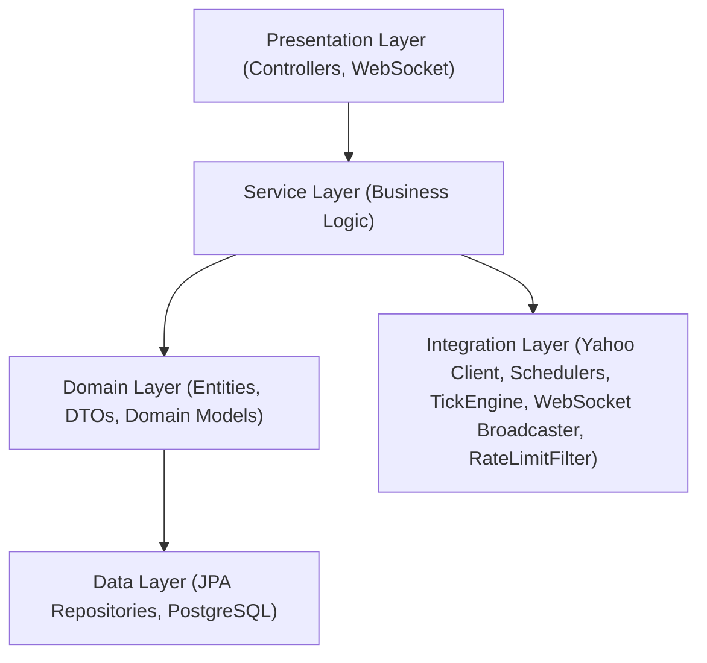
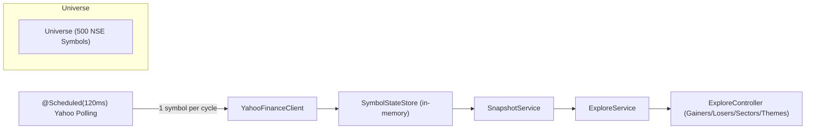
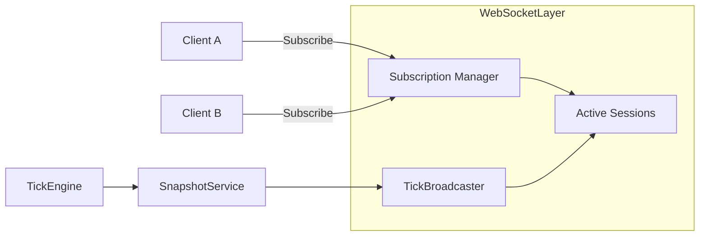
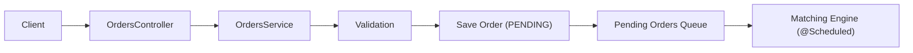
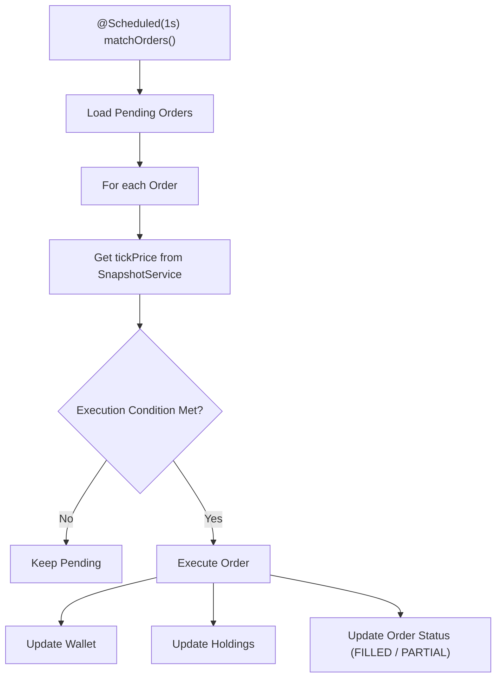
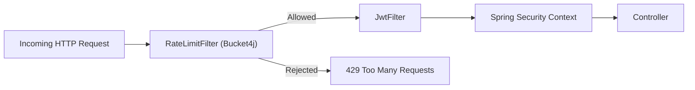
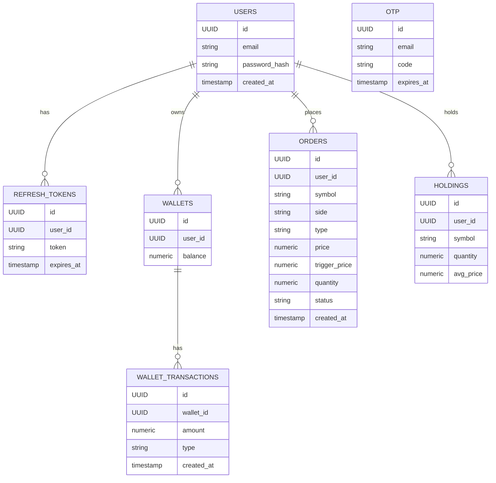

# ARCHITECTURE.md  
Finance Manager Backend — Trading Simulation Platform

---

## 1. Introduction

This document describes the **system architecture** of the Finance Manager Backend — a **paper‑trading platform** that uses **real NSE market data (15‑minute delayed)**, **virtual money**, and a **simulated trading engine**.

The goals of this architecture are:

- To simulate a **real brokerage‑style trading backend**
- To handle **real‑time market data** efficiently
- To maintain **clean separation of concerns**
- To be **scalable, maintainable, and extensible**
- To showcase **production‑grade backend engineering skills**

---

## 2. High‑level system architecture

```mermaid
flowchart LR
    Client["Client Web/Mobile"] -->|HTTP (REST)| API["Spring Boot REST Controllers"]
    Client -->|WebSocket| WS["WebSocket Endpoint"]

    API --> SVC["Service Layer"]
    WS --> RT["Real-Time Tick Stream"]

    SVC --> MD["Market Data Services"]
    SVC --> ORD["Orders & Trading Engine"]
    SVC --> WAL["Wallet Service"]
    SVC --> HLD["Holdings Service"]
    SVC --> PRT["Portfolio Service"]
    SVC --> EXP["Explore Service"]

    MD --> YF["YahooFinanceClient"]
    YF -->|HTTP| Yahoo["Yahoo Finance API"]

    SVC --> REPO["JPA Repositories"]
    REPO --> DB["PostgreSQL"]

    subgraph RealTime
        MD --> SNAP["SnapshotService"]
        SNAP --> TICK["TickEngine"]
        TICK --> RT
        TICK --> EXP
    end
```

---

## 3. Layered architecture



---

## 4. Market data architecture

### 4.1 Explore mini‑universe (500 stocks)



---

### 4.2 WebSocket architecture



---

## 5. Trading engine architecture

### 5.1 Order placement flow



---

### 5.2 Matching engine



---

## 6. Security & rate limiting architecture



---

## 7. Database architecture (PostgreSQL)



---

## 8. Scalability & future enhancements

- Horizontal scaling  
- Redis caching  
- Kafka event‑driven architecture  
- Microservices split (Auth, Market Data, Trading, Wallet, Portfolio)

---

## 9. Conclusion

This architecture combines:

- Real NSE market data  
- Virtual money  
- Real‑time tick streaming  
- A realistic trading engine  
- PostgreSQL persistence  
- JWT security + rate limiting  

It is designed to be scalable, maintainable, and production‑grade.

